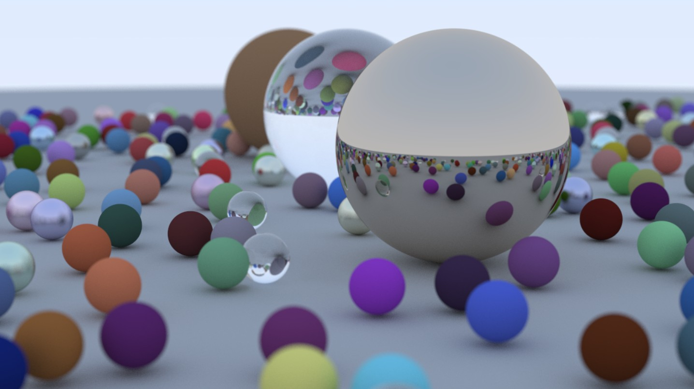

# Ray Tracer

A CPU-based ray tracer implemented in C++ following the [_Ray Tracing in One Weekend_](https://raytracing.github.io/) books series.

## Features

- **Multiple Materials**: Lambertian (diffuse), Metal, Dielectric (glass), and Emissive (lights)
- **Textures**: Solid colors, checker patterns, and image textures
- **Geometric Primitives**: Spheres, quads (rectangles), and arbitrary boxes
- **Camera Controls**: Adjustable field of view, position, and focus
- **Other Features**:
  - Depth of field (defocus blur)
  - Volumetric rendering (constant medium/smoke)
  - BVH (Bounding Volume Hierarchy) acceleration

## Take a look at my big, shiny balls!!



## Building

The project uses CMake with presets for different build configurations:

```bash
# Configure with default preset
cmake --preset=default

# Build the project
cmake --build build --config Release

# Or use Debug configuration
cmake --build build --config Debug
```

The executable will be created in the `build/Release/` or `build/Debug/` directory.

## Usage

Run the compiled executable:

```bash
# Windows
.\build\Release\ray_tracer.exe

# Linux/Mac
./build/Release/ray_tracer
```

The program outputs a PPM image file that can be viewed with image viewers or converted to common formats.

### Scenes

There are already multiple scenes defined, modify the switch statement in [src/main.cpp](src/main.cpp) to select different scenes or create your own by following the existing examples.